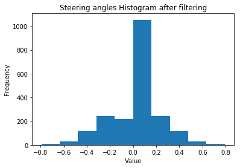
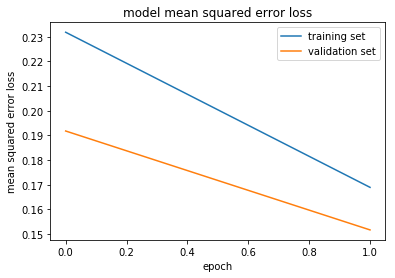

**Behavioral Cloning** 

Writeup Template

**Behavioral Cloning Project**

The goals / steps of this project are the following:
* Use the simulator to collect data of good driving behavior
* Build, a convolution neural network in Keras that predicts steering angles from images
* Train and validate the model with a training and validation set
* Test that the model successfully drives around track one without leaving the road
* Summarize the results with a written report


Rubric Points
Here I will consider the [rubric points](https://review.udacity.com/#!/rubrics/432/view) individually and describe how I addressed each point in my implementation.  

---
Files Submitted & Code Quality

1. Submission includes all required files and can be used to run the simulator in autonomous mode

My project includes the following files:
* model.py containing the script to create and train the model
* drive.py for driving the car in autonomous mode
* model.h5 containing a trained convolution neural network 
* writeup_report.md or writeup_report.pdf summarizing the results
It also includes Jupyter Notebook versions of model, drive and video:
* model.ipynb
* drive.ipynb
* video.ipynb

Finally the video of a couple of autonomus laps is included as:
* recorded_images.mp4

2. Submission includes functional code
Using the Udacity provided simulator and my drive.py file (and Notebook version drive.ipynb), 
the car can be driven autonomously around the track by executing 
```sh
python drive.py model.h5
```

3. Submission code is usable and readable

The model.py file contains the code for training and saving the convolution neural network. 
The file shows the pipeline I used for training and validating the model, 
and it contains comments to explain how the code works.

### Model Architecture and Training Strategy

1. An appropriate model architecture has been employed

My model consists of the following architecture (lines 170 to 189 of model.py):

The model is feeded with a processed image, cropped, apply a soft blur and resized, 
and converted to YUV color space, the resulting image has the shape: 66 * 200 * 3
After several hours of testing with different settings and due to my 
hardware limitations (and i3, no GPU and 8Gb of Ram). image was limited 
to meaningfull information. drive.py file was modified accordingly.

Also cropping was done in the batch generator function (instead of in the same Keras sequential model).

Normalizaion: 

model.add(Lambda(lambda x: x/127.5 - 1.0, input_shape=(cropped_height,cropped_width,3)))

Then 3 convolutional layers of 5*5 and deph frmo 24 to 48 were added, with a regularization factor of 0.0005
and Relu activation functions:

Add 3 * 5x5 convolution layers (output depth 24, 36, and 48), each with 2x2 stride

model.add(Conv2D(24, (5, 5), strides=(2, 2), padding='valid', kernel_regularizer=l2(reg_factor), activation="relu"))

model.add(Conv2D(36, (5, 5), strides=(2, 2), padding='valid', kernel_regularizer=l2(reg_factor), activation="relu"))

model.add(Conv2D(48, (5, 5), strides=(2, 2), padding='valid', kernel_regularizer=l2(reg_factor), activation="relu"))

Two more convolutional layers of 64 of deph each follows with the same regularization factor as the previous 3 layers:,
and also with Relu activations:

Add 2 * 3x3 convolution layers (output depth 64, and 64)

model.add(Conv2D(64, (3, 3), padding='valid', kernel_regularizer=l2(reg_factor), activation="relu"))

model.add(Conv2D(64, (3, 3), padding='valid', kernel_regularizer=l2(reg_factor), activation="relu"))

Add a flatten layer

model.add(Flatten())

Finally after a flatten operation, 4 fully connected layers of 100, 50, 10 and 1 were added:

4 Fully connected layers of 100, 50, 10 and 1

model.add(Dense(100, kernel_regularizer=l2(reg_factor), activation="relu"))

model.add(Dense(50, kernel_regularizer=l2(reg_factor), activation="relu"))

model.add(Dense(10, kernel_regularizer=l2(reg_factor), activation="relu"))

model.add(Dense(1))

This Covnet was based on several posts about this topic, and prove to be more capable than the LeNet 
which I used first for this project.

2. Attempts to reduce overfitting in the model

I tested several ways, and found that this covnet with just 2 epochs generalized quite well 
and didn't produced overfitting (however its error is relative high, the final result for the 
driving experience is amazing).

The model was trained and validated on different data sets to ensure that the model was not overfitting,
in particular I finally used my own captured data, with some hard recovery maneuvres
and data augmentation was performed with the proposed flip technique and steering angle correction 
for the left and right additional cameras was implemented.

The model was tested by running it through the simulator and ensuring that the vehicle could stay on the track,
for continous testins over several laps (I stopped once I saw it always perform as expected).

3. Model parameter tuning

The model used an adam optimizer, with a 0.0001 learning rate (model.py line 193).

4. Appropriate training data

Training data was chosen to keep the vehicle driving on the road. 
Based on histograms, I filtered center driving samples to get a more normalized final dataset,
and tihis was the key for car stability and to train the covnet properly for a soft drive in 
the center as well as fast recovery for the curves.

For details about how I created the training data, see the next section. 

Model Architecture and Training Strategy

1. Solution Design Approach

I started with a LeNet model, which worked quite good for many parts of the track, but was limited 
to handle the whole loop.

Then after reading several posts I decided to use the more complex and flexible covnet architecture
described previously.

Also I started with the full size color images (RGB), but with my limited system, and as initially I didn't 
implemented the generators, it was a bit of overhead for its ram and processing capacity (no GPU at all).
I decided to read a bit about NVidia Covnet and found that YUV color space was recommended, 
and also performed the cropping, blur and resizing.
I started with a vertical cropping and then also added an horizontal resize, 
ending with a 66 * 200 version, which even generalized better.

But the key was to make a more uniform steering angles histogram, filtering center samples, 
that was what really makes the difference, even with a reduced number of samples.

At the end of the process, the vehicle is able to drive smoothly autonomously around the track without leaving the road,
and without artificial zig zags like movements, it really looks as human behaviour.

2. Final Model Architecture

Final model architecture was described in point 1, and it is basically composed by
the following layers:

Normalizaion: 
model.add(Lambda(lambda x: x/127.5 - 1.0, input_shape=(cropped_height,cropped_width,3)))

Then 3 convolutional layers of 5*5 and deph frmo 24 to 48 were added, with a regularization factor of 0.001
and Relu activation functions:

Add 3 * 5x5 convolution layers (output depth 24, 36, and 48), each with 2x2 stride
model.add(Conv2D(24, (5, 5), strides=(2, 2), padding='valid', kernel_regularizer=l2(reg_factor), activation="relu"))

model.add(Conv2D(36, (5, 5), strides=(2, 2), padding='valid', kernel_regularizer=l2(reg_factor), activation="relu"))

model.add(Conv2D(48, (5, 5), strides=(2, 2), padding='valid', kernel_regularizer=l2(reg_factor), activation="relu"))

Two more convolutional layers of 64 of deph each follows with the same regularization factor as the previous 3 layers:,
and also with Relu activations:

Add 2 * 3x3 convolution layers (output depth 64, and 64)
model.add(Conv2D(64, (3, 3), padding='valid', kernel_regularizer=l2(reg_factor), activation="relu"))

model.add(Conv2D(64, (3, 3), padding='valid', kernel_regularizer=l2(reg_factor), activation="relu"))

Add a flatten layer
model.add(Flatten())

Finally after a flatten operation, 4 fully connected layers of 100, 50, 10 and 1 were added:
4 Fully connected layers of 100, 50, 10 and 1
model.add(Dense(100, kernel_regularizer=l2(reg_factor), activation="relu"))

model.add(Dense(50, kernel_regularizer=l2(reg_factor), activation="relu"))

model.add(Dense(10, kernel_regularizer=l2(reg_factor), activation="relu"))

model.add(Dense(1))

3. Creation of the Training Set & Training Process

I started to capture a regular lap in Linux (base OS for processing), but the Unity app was not performing good without 
a good GPU, so I retried booting in Windows, which was much better for this purpose, and the app run smoother, hence 
I was able to get a couple of great loops.
In particular I slowed the vehicle to get more samples and detail in the turns, and also recorded a couple of hard recoveries well.

The system performs the following preprocess:

1) Filter center steering angles to get a more uniform dataset
2) Shuffle the samples
3) Get the 3 cameras for each sample (left, right and center)
4) Add correction for the steering angle for left and right
5) Creat the flipped (horiz mirror) version of images and of angles
6) Cropp images from 132 * 320 to 66 * 320
7) Add soft blur
8) Resize from 66 * 320 to 66 * 200
9) Convert form RBG to YUV color space

Form this resulting set I used 80% for training and 20% for validation.

I found that for this covnet and for the selected data 2 epochs was optimal, 
although with more epochs error was lower, with just 2 the model generalized 
quite good and this prevented overfitting.

Original angles histogram:


Filtered center angles histogram:




Epochs history:




Center image sample:


Soft center image sample:


Recovery:


Soft recovery:


